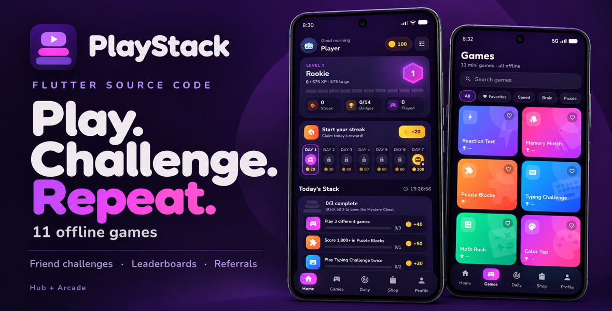
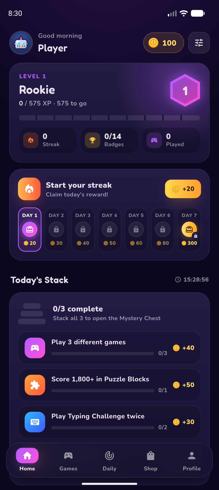
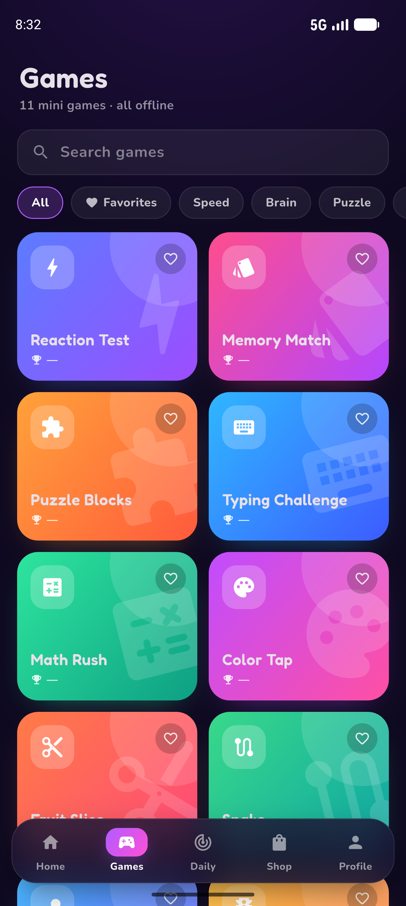
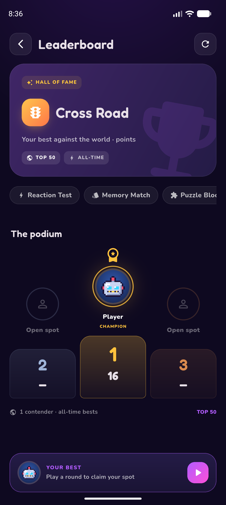
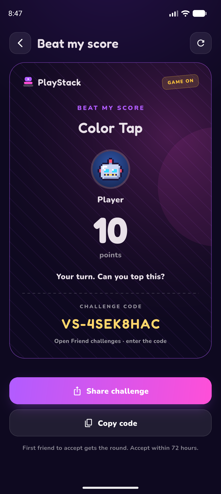

# 🎮 PlayStack — 11 Offline Mini Games | Flutter Source Code

### Play. Challenge. Repeat.

Build your own games app with **PlayStack** — a colorful Flutter project combining 11 offline mini games, player progression, and social challenges.

**[📥 Download Android Demo](https://github.com/TornadozGit/PlayStack/releases/download/v1.0.0/app-release.apk)**  
**[🛒 Get Full Source Code on Weeb Market](https://weebket.com/product/detail/49/playstack-11-offline-mini-games-rewards-social-challenges-flutter-source-code)**

---

## ✨ What makes PlayStack different?

- **11 offline mini games** bundled inside the app.
- **Friend challenges** with shareable codes and branded challenge cards.
- **Per-game leaderboards** with a podium and personal-best records.
- **Referral rewards** with configurable coin bonuses.
- **XP, levels, coins, daily streaks, and achievements.**
- **Daily challenges, weekly quests, and a Mystery Chest.**
- **A coin shop** with themes, avatars, frames, and boosts.
- **Personalized Home picks**, game search, filters, and favorites.
- **Manual payout requests** submitted to Firebase for admin review.
- **AdMob or Unity Ads integration.**
- **Two app modes from one Flutter project.**

---

## 📱 Screenshots

  
  

  
  

---

## 🕹️ 11 games to explore

Reaction Test · Memory Match · Puzzle Blocks · Typing Challenge · Math Rush · Color Tap · Fruit Slice · Snake · Bubble Shooter · Cross Road · Balloon Pop

Gameplay works offline. Ads and Hub online features require an internet connection.

---

## 🔀 Choose your app experience

### Arcade
A focused games collection with offline gameplay, local records, favorites, and free themes. No Firebase player identity is created.

### Hub
The complete progression experience with XP, coins, daily rewards, achievements, a shop, leaderboards, referrals, friend challenges, and manual payout requests.

The app owner selects the mode before building. Players do not switch modes inside the app.

Hub uses a background Firebase anonymous identity, without a visible registration or login screen.

---

## 📦 What is included with your purchase?

- Editable Flutter source project with Android and iOS project folders.
- All 11 bundled HTML5 games and their Flutter integration.
- Hub and Arcade modes.
- Theme, avatar, game, and reward configuration files.
- Firebase Realtime Database rules for Hub features.
- AdMob and Unity Ads configuration.
- Installation and customization documentation.

Payouts are handled manually by the app operator. Firebase stores requests and their status; it does not transfer money.

---

## 🛠️ Optional installation service

Includes:
- Change app name.
- Change package name / iOS bundle ID.
- Change app logo.
- Configure ads.

Source code purchase and installation service are separate.

---

## 🚀 Try PlayStack

**[📥 Download Android Demo](https://github.com/TornadozGit/PlayStack/releases/download/v1.0.0/app-release.apk)**  
**[🛒 Get Full Source Code on Weeb Market](https://weebket.com/product/detail/49/playstack-11-offline-mini-games-rewards-social-challenges-flutter-source-code)**

This repository contains the demo and promotional assets. The full Flutter source code is sold separately on Weeb Market.
